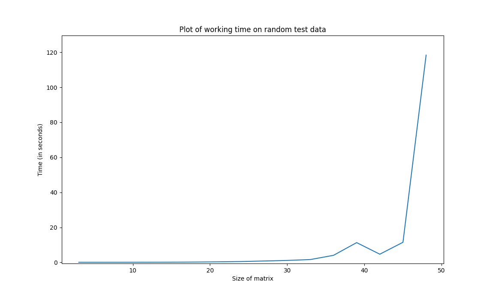

# Nonogram-Solver

[Nonogram](https://en.wikipedia.org/wiki/Nonogram) je hra, ve které musíte rekonstruovat obdélníkový obrázek (každá buňka je buď nakreslená nebo prázdná), mající rozměry vyplněných bloků v každém řádku a sloupci. Tento projekt byl vytvořen pro řešení Nonogramu pomocí SAT-solveru. K řešení byl použit SAT-solver [Glucose](https://github.com/audemard/glucose).

## Popis Nonogramu

Hra Nonogram obvykle vypadá jako pole N x M, kde je vedle každého řádku a sloupce napsána sada čísel --- velikosti vyplněných bloků v odpovídajícím řádku/sloupci. Například sade (1, 3, 2) může odpovídat řetězec ..#..###.##. (prázdné buňky označíme tečkou a vyplněné buňky mřížkou). Všimněte si, že pořadí čísel v řádcích a sloupcích je důležité. Nonogram můžete vyzkoušet na tomto [odkazu](https://www.goobix.com/games/nonograms/).

## Uživatelská dokumentace

### Vstupni data

Pro náš program je nutné zadat vstupní data v následujícím formátu:

```
N M                             // velikosti polí
                                // prázdný řetězec (pro čitelnost)
r[1,1] r[1,2] ... r[1, R_1]     // velikosti bloků v prvním řádku
r[2,1] r[2,2] ... r[2, R_2]     //       ...         druhém řádku
              ...
r[N,1] r[N,2] ... r[N, R_N]   
                                // prázdný řetězec znovu

s[1,1] s[1,2] ... s[1, S_1]     // velikosti bloků v prvním sloupci
s[2,1] s[2,2] ... s[2, S_2]     //       ...         druhém sloupci
              ...
s[M,1] s[M,2] ... s[M, S_M]  

```

Bude například následující obrázek

```
...#.
...##
##.##
#.#.#
###..
```

mít takový vstup

```
5 5

1
2
2 2
1 1 1
3

3
1 1
2
3
3
```

### Spuštění programu

Ke spuštění programu použijte následující skript:

```
nonogram.py [-h] [-i INPUT] [-f FORMULA] [-o OUTPUT] [-s SOLVER]
```
Možné argumenty:

```
-h, --help            show this help message and exit
-i, --input INPUT     path of an input file | default = input.txt
-f, --formula FORMULA
                    output file for a cnf formula (in DIMACS format) | default = formula.cnf
-o, --output OUTPUT   path of an output file for a picture | if not setted - into std out
-s, --solver SOLVER   path to a sat-solver file | default = glucose
```

### Příklady vstupních dat

V adresáři sample_inputs lze nalézt následující soubory:

```
5x5-sat.in          -> maly splnitelny vstup
5x5-unsat.in        -> maly nesplnitelny vstup
15x15-sat.in        -> trocju vetsi splnitelny vstup
big-sat.in          -> 29 x 21 splnitelny
very-big-sat.in     -> 50 x 25 splnitelny
extra-big-sat.in    -> 100 x 90 splnitelny (pracovní doba na mém počítači je asi 30 sekund)
```

## Kódování

Definujme tři typy proměnných:
- pole(i, j) -- (zkráceně $p(i, j)$) je roven jedné, pokud je buňka (i, j) nakreslena (v kódu - field_variable).
- řádkový_blok(i, j, k) -- (zkráceně $rb(i, j)$)  $k$-tý blok v řádku $i$ začíná ve sloupci $j$ (v kódu - row_block_variable).
- sloupcový_blok(i, j, k) -- (zkráceně $cb(i, j)$)  $k$-tý blok ve sloupci $j$ začíná ve řádku $i$ (v kódu - column_block_variable).

Nyní napíšeme všechna potřebná omezení:

- pokud je proměnná řádkoveho bloku rovna 1, pak se všechny odpovídající buňky pole musí rovnat 1 (pokud se blok úplně nevejde, je odpovídající proměnná nula). To znamená, že pro každy $i, j, k$: $rb(i, j, k) \implies (p(i, j) \land p(i, j + 1) \land ... \land p(i, j + r[i, k])) \sim  (\lnot rb(i, j, k) \lor p(i, j)) \land (\lnot rb(i, j, k) \lor p(i, j + 1)) \land ... \land (\lnot rb(i, j, k) \lor p(i, j + r[i, k]))$

- podobně pro sloupcové proměnné: $cb(i, j, k) \implies (p(i, j) \land p(i + 1, j) \land ... \land p(i + c[j, k], j)) \sim  (\lnot cb(i, j, k) \lor p(i, j)) \land (\lnot cb(i, j, k) \lor p(i + 1, j)) \land ... \land (\lnot cb(i, j, k) \lor p(i + c[j, k], j))$

- každý řádkový blok začíná přesně v jednom sloupci: pro $j_1 \neq j_2$: $ \lnot rb(i, j_1, k) \lor \lnot rb(i, j_2, k)$

- analogicky pro řadky $i_1 \neq i_2$: $\lnot cb(i_1, j, k) \lor \lnot cb(i_2, j, k)$

- v každém řádku někde začíná blok číslo 1: $(rb(i, 1, 1) \lor rb(i, 2, 1) \lor ... \lor rb(i, M, 1))$

- v každém sloupci někde začíná blok číslo 1: $(cb(1, j, 1) \lor rb(2, j, 1) \lor ... \lor rb(N, j, 1))$

- v každém řádku, po každém bloku někde (alespoň o jednu buňku dále) začíná další blok: $rb(i, j, k - 1) \implies (rb(i, j + r[i, k - 1] + 1, k) \lor rb(i, j + r[i, k - 1] + 2, k) \lor ... \lor rb(i, M, k)) \sim \lnot rb(i, j, k - 1) \lor (rb(i, j + r[i, k - 1] + 1, k) \lor rb(i, j + r[i, k - 1] + 2, k) \lor ... \lor rb(i, M, k))$.

- analogicky pro sloupce: $\lnot cb(i, j, k - 1) \lor (cb(i + c[j, k - 1] + 1, j, k) \lor cb(i + c[j, k - 1] + 2, j, k) \lor ... \lor rb(N, j, k))$.

- pokud je buňka pole rovna jedné, pak je v jejím řádku nějaký blok, který ji zakrývá a rovná se 1 : $p(i, j) \implies (\bigvee \limits_k (\bigvee \limits_{j'} rb(i, j', k)))$, kde $j' = max(1, j - r[i, k] + 1, 1)\ ...\ j$ (poněkud ošklivá omezení kvůli tomu, že nechceme blok, který by začínal zápornými čísly). Nebo ve formátu CNF – klauzule: $\lnot p(i, j) \lor (\bigvee \limits_k (\bigvee \limits_{j'} rb(i, j', k)))$

- analogicky pro sloupci: $\lnot p(i, j) \lor (\bigvee \limits_k (\bigvee \limits_{i'} cb(i', j, k)))$, kde $i' = max(1, i - s[j, k] + 1, 1)\ ...\ i$

## Experiment

Experiment byl proveden na mém počítači následovně. Náhodně generované obrázky různých velikostí. Tyto obrázky byly zašifrovány jako vstup do ./nonogram.py a byla měřena doba běhu programu. Výsledky můžete vidět v následujícím grafu:



Podle grafu vidíme, že pracovní doba roste poměrně rychle (pravděpodobně exponenciálně). Pracovní doba přitom silně závisí na vstupních datech – i u obrazku stejne velikosti se může výrazně lišit.
